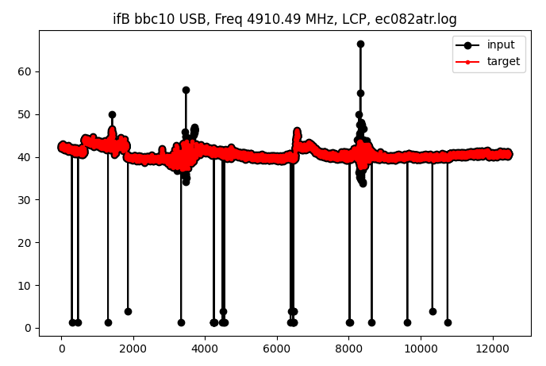

# GENERAL

This package ports the original antabfs program 
(see [VLBI-utilities](https://github.com/evn-vlbi/VLBI-utilities) repository) 
to python3 and implements several other modifications. The main rationale behind this
package is to enable gathering information provided by users in order to
help building training sets that will be useful in machine learning 
approach to generating antab files automatically. 
The program also:
- unifies tabs/spaces convention of the original program, 
- improves modularization/re-usability of the code,
- provides support for configuration files and command line parser, 
- helps extracting data from log/antabfs files (e.g from past EVN sessions),
- provides basic plotting options for the gathered outputs and
- introduces experimental, Makefile-based, antab files processing pipeline.

This version of the program is developed at Toruń VLBI station, but the core functionality
related to processing logs and generating antabs is largely unchanged and compatible with
antabfs program version '20201123'.

The name of the program "antabTr" is a variation of the original name and indicates
that the program collects and stores users input as training data useful
in machine learning.

The user has a choice to decide when or if the collected data should be shared and 
made visible to other contributors.


# DOWNLOAD

```
git clone https://github.com/bslew/antabTr.git
```

# INSTALL

Download the package from git repository

## Installation steps

Change directory to newly downloaded antabTr repository, create and activate virtual environment,
update it and install required packages.

```
cd antabTr
python3 -m venv venv
. venv/bin/activate
pip install --upgrade pip
pip install -r requirements.txt

```

Make sure the venv is located in antabTr subdirectory.

Execute

```
make install
```

Now edit ~/.config/antabfs/antabfs.ini config file to match your preferences.
The config file currently defines the location of the .rxg files required to generate .antab files.
This is the only user-side option that needs to be specified, although several other options
are also available.

# Use

Use antabTr.py from virtual environment, i.e activate the environment unless you already have done so:

```
cd antabTr
. venv/bin/activate
```

"(venv)" prompt will appear to indicate you are in the virtual environment.

```
antabTr.py --help
```

## Generating antab files
Go to your logs directory and use the antabTr.py program instead of antabfs.py:

```
antabTr.py ea065btr.log
```

Any pre-processing of the log files that were necessary before should also be
done with `antabTr.py` program


# Wisdom

antabTr.py program should be used in the same way as the original antabfs.py program for 
generating antab files but
this version will automatically store the information about how the user cleans the data.
That information is stored in wisdom files.
Wisdom files are meant to simplify I/O operations in ML approach to automatic generation of antabs.
Any pre-processing steps on logs that are possibly performed prior to using antabfs.py should also be
performed when using antabTr.py. The Makefile scripts makes some of that steps easier, but using 
the Makefile pipeline is currently in experimental stage (type `make help` for more information)

Since typically the Tcal information from RXG files is not sent to VLBeer server, it is not 
directly possible to extract the wisdom from .antab nor from .log files, or from the combination of the two. 
This is one of the reasons why wisdom is collected.

## Storing wisdom files
If you cancel execution of the antabTr.py program
before saving your final `.antabfs` file and then restart processing the same log file,
the program will continue from the point your left off using the wisdom data stored in the local
directory. The wisdom files are stored by default in the 'wisdom' sub-directory
in `.awpkl` files.
The wisdom files contain Tsys data from both the log file and from the generated antab file.
To enlarge training, under certain conditions set such information can also be extracted for past EVN sessions from analyses 
of both .log and .antab files.

## Plotting .awpkl files

In order to plot wisdom from awpkl file use eg:

```
antabTr.py --plot_wisdom wisdom/example.awpkl
```

Example wisdom data



awpkl files are typically located in "wisdom" subdirectory.

## Correcting/re-generating antab files

If you wish to reprocess your log file all over again without loading the wisdom from the previous run, simply
go to the wisdom directory and remove the file[s] corresponding to that log file.

## Sharing
It will be useful if you decide to share the wisdom gathered by this program after your antab files
are prepared and ready to export to VLBeer. After all, this is one of the reasons for writing
this variation of the original program. In order to share the wisdom execute:

```
share_wisdom.py
```

script in the directory where you started antabTr.py program.
The wisdom files will be sent to a remote server in order to improve machine learning training process
that will eventually remove the need for manual preparation of antab files.

The server will ask you for a password, which is the same as the one used for uploading antab files
to VLBeer. Alternatively, if you do not want to enter the password every time you run this script,
please send your public ssh-key to the author.

In time, the wisdom will be made publicly available via [antab-wisdom](https://github.com/bslew/antab-wisdom)
repository.

**Do not share wisdom files in case when you decide to upload noisy (i.e. not cleaned)
data to VLBeer, unless the data doesn't really contain any RFI
that should be tagged for removal in the antabTr.py program.**

### What is shared?

Only wisdom files are being shared. Wisdom files are python3 pickled dictionaries containing the name of log file,
the input Tsys (`X` key in the pickled dictionary) data, 
cleaned Tsys data (`Y` key) and perhaps what is most interesting
the indexes of the points that were marked as noise by the user. Those, if present are 
found under `ridx` key in the pickled dictionary.
Note that the data stored under key `Y` is generated by the antabTr.py program
based on the information provided by the user and processing of the input (`X`) 
data.

The naming of the wisdom files follows convention:

`yyyy-mm.logfile_prefix.user_name.bbc.awpkl`

where:
- yyyy-mm are year and month at saving time
- logfile_prefix is the log file name without extension (VLBI experiment with station code)
- user_name is the value of the $USER environment variable
- bbc - an integer
- awpkl - wisdom files extension

Hence, sharing wisdom is equivalent with sharing fraction of the information stored in
.antabfs files, .log files and .rxg files.

## Multiple uploads
If you shared the wisdom once and then decided to correct and regenerate the antab files you can
share_wisdom.py again. The files will be uploaded again and their previous version will be overwritten if
the updated version of the antab files is generated the same month as the previous one which results from
the naming convention of the wisdom files.


## Extracting wisdom files from past EVN sessions data

Although, there is not enough information in log and antabfs files (on VLBeer)
to recreate information about which data the user has removed during antab preparation,
at least some information can be extracted, as many years of user experience ha
already been uploaded to VLBeer server.

The provided `extract_wisdom.py` script along with `antabTr.py` can be 
used to extract 
part of that information stored in antabfs and log files. 
See

```
extract_wisdom.py --help
```

This is done by e.g.

```
antabTr.py --extract_wisdom --antabfs clean/vlbeer-mar18-n18c1ys.antabfs clean/vlbeer-mar18-n18c1ys.log
```

The program extracts Tsys from the log file even if the calibration is 
not available and stores it as (noisy) inputs. The target data is taken from the corresponding
antab file. The calibration of the input is inferred from the most likely (most frequent) target/input ratio,
although several other check are performed before the extracted wisdom enters the training
set. Extracting wisdom also automatically rejects parts of the data from the beginning
and end of the session (controlled by parameters in the configuration files) as it is not easy 
to clean those regions manually with the original (and current) version of the the antabfs
program.

Unfortunately, there is no way to restore information about which particular data points
the user have manually marked as noisy during the antab preparation, and hence 
training sets generated this way, although larger, will necessarily be noisier.

# Examples
In *examples/validate* directory there are some examplary data that can be used to validate
compatibility of the modifications of the current version of the program with the 
original 20201123 version from python2. The provided log file, '**ec071mtr.log**', is
a typical log from a 5GHz experiment.

The antabfs file, '**ec071mtr.antabfs.orig**', is the antab file generated by the
original 20201123 version of the antab program using the calibration files
from the local directory.

```
python2 antabfs.py ec071mtr.log 
```

For the **demonstration purpose only**, while generating this file, only
Tsys<10K data were removed and only for the bbc01. All other channels were not cleaned.


The antabfs file '**ec071mtr.antabfs**' was generated using this version of the program
(antabTr.py) in the analogous way. 

```
antabTr.py ec071mtr.log --rxgDir rxg_files/
```
The program have generated wisdom subdirectory
and stored wisdom files in it.

A comparison the two files confirms the files are identical.

```
diff ec071mtr.antabfs ec071mtr.antabfs.orig
```


# AUTHOR
Bartosz Lew [<bartosz.lew@umk.pl>](bartosz.lew@umk.pl)

